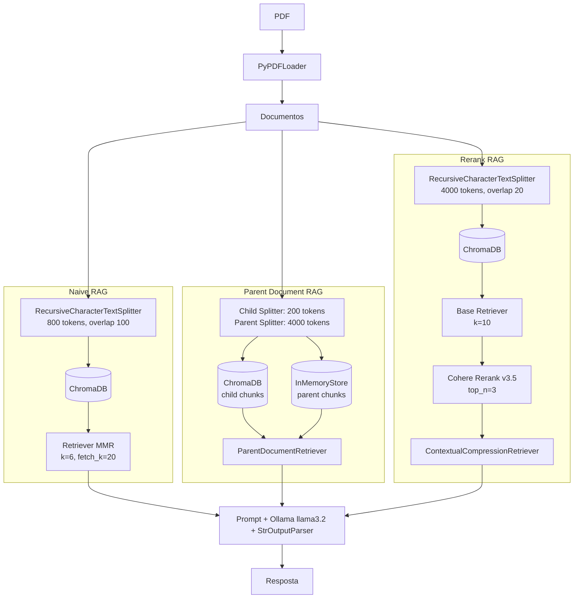

# RAG Architectures

Sistema de perguntas e respostas sobre documentos PDF usando modelos de linguagem locais. Três arquiteturas RAG diferentes, rodando inteiramente na sua máquina.

[](<COLE_O_LINK_DO_DEPLOY_AQUI>)
[](<COLE_O_LINK_DO_POST_AQUI>)

---

## Arquitetura



---

## O que esse projeto faz

Você aponta um PDF, escolhe uma das três estratégias de RAG e começa a fazer perguntas sobre o conteúdo do documento. Tudo roda local com Ollama, sem depender de APIs pagas (exceto a opção de Rerank, que usa Cohere).

Implementei três pipelines completos de RAG para comparar como cada abordagem lida com recuperação de contexto:

- **Naive RAG** com chunking recursivo e busca MMR para balancear relevância e diversidade nos resultados
- **Parent Document RAG** com indexação em dois níveis, onde chunks pequenos buscam e chunks grandes alimentam o modelo, resolvendo o trade off entre precisão de busca e riqueza de contexto
- **Rerank RAG** com Cohere Rerank v3.5 filtrando os 10 melhores candidatos para os 3 mais relevantes, porque recuperar mais nem sempre é recuperar melhor
- Validação de ambiente antes de rodar (Ollama ativo, modelo disponível) para evitar erros silenciosos
- Persistência dos índices vetoriais em disco com ChromaDB, sem precisar reprocessar o PDF toda vez

---

## Tecnologias

| Categoria | Ferramenta |
| --- | --- |
| Linguagem | Python |
| Framework LLM | LangChain |
| LLM local | Ollama (llama3.2) |
| Embeddings | Ollama Embeddings |
| Banco vetorial | ChromaDB |
| Reranking | Cohere Rerank v3.5 |
| Leitura de PDF | PyPDF |
| Variáveis de ambiente | python-dotenv |

---

## O que eu aprendi

Esse projeto me forçou a entender como cada decisão no pipeline de RAG afeta a qualidade da resposta final. Mexer com chunk_size, overlap e estratégias de busca parece detalhe, mas muda tudo. Aprendi a debugar problemas que não dão erro, só dão respostas ruins, e isso exigiu paciência para testar hipóteses e comparar resultados sem métrica óbvia.

No lado técnico, saí daqui confortável com LCEL (a linguagem de composição de chains do LangChain), com persistência de vector stores e com a diferença prática entre busca por similaridade, MMR e reranking. Também aprendi a pensar em modularidade desde o início, separando responsabilidades para conseguir trocar peças do pipeline sem quebrar o resto.

---

## Como rodar localmente

**1. Clone o repositório**

```bash
git clone <COLE_A_URL_DO_REPOSITORIO_AQUI>
cd rag-pdf
```

**2. Instale as dependências**

```bash
python -m venv .venv
source .venv/bin/activate  # Linux/Mac
# .venv\Scripts\activate   # Windows

pip install -r requirements.txt
```

**3. Suba o Ollama e rode**

```bash
ollama pull llama3.2
python app.py
```

> Se for usar o Rerank RAG, crie um arquivo `.env` na raiz com sua chave da Cohere:
> ```
> COHERE_API_KEY=sua_chave_aqui
> ```
